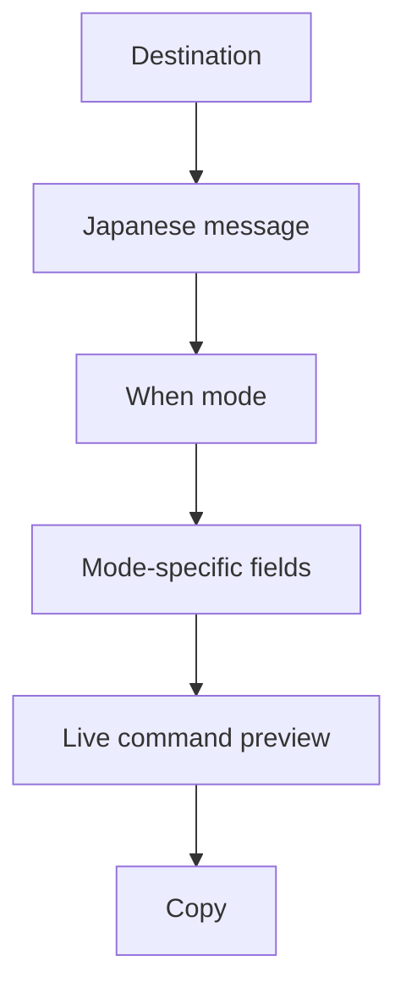

# Slack Remind Command Generator - Plan

## Goal Capsule

- **Objective:** A person can fill a one-page form and copy a Slack `/remind` command that is valid English syntax with a Japanese message body.
- **Product authority:** This plan owns v1 of a personal, browser-only generator. Later GitHub Pages hosting is a distribution goal, not a separate product.
- **Open blockers:** None that block planning. Recurrence option coverage is bounded by what Slack actually accepts (see Assumptions and Outstanding Questions).

## Product Contract

### Summary

Build a static web page that assembles `/remind` from structured fields (who, Japanese message, when-mode) and copies the result. No Slack API, no accounts, no saved history.

### Problem Frame

Slack `/remind` syntax is easy to get wrong, especially recurrence and destination. The user currently writes commands by hand and wants a generator they can run locally first, then publish as a static site.

### Key Decisions

- **Form builder, not natural-language parsing.** `(session-settled: user-directed — chosen over NL-from-one-sentence and hybrid when-parser: reliable Slack phrasing and a later GitHub Pages static site)` Governs R1, R6.
- **Local first, static hosting later.** `(session-settled: user-directed — chosen over team-shared backend or public-from-day-one: start on the author's machine)` Governs R10.
- **Copy-only v1.** `(session-settled: user-directed — chosen over templates or generation history: smallest useful loop)` Governs R5.
- **English command shell, Japanese body.** `(session-settled: user-directed — chosen over all-Japanese or bilingual toggle: workspace prefers English `/remind` keywords)` Governs R3.
- **Single-column layout with live preview at the bottom.** `(session-settled: user-directed — chosen over two-column preview and stepped wizard: all fields visible at once)` Governs R1, R4.
- **When input is mode-then-fields.** `(session-settled: user-directed — chosen over calendar-first or preset buttons: wide recurrence stays tractable)` Governs R6, R7.

### Actors

- A1. The person who pastes the generated command into Slack (also the only operator of the page).

### Requirements

**Command assembly**

- R1. The page is a single screen: destination, message, when-mode, then only the fields that mode needs, then a live command preview, then copy.
- R2. Destination is one of: the operator (`me`), a channel name, or a user name. Channel and user fields are shown only for those modes.
- R3. The generated command uses English `/remind` keywords and time phrases. The reminder text may be Japanese.
- R4. The preview updates as fields change, without a separate "generate" step.
- R5. A copy action puts the full command on the clipboard. If clipboard access fails, the preview stays selectable so the operator can copy manually.

**When coverage**

- R6. When-mode is chosen first. Modes in v1: one-shot, every day, every weekday, every week on selected weekdays, every other week, every month.
- R7. Each mode shows only the fields it needs (for example one-shot shows date and time; weekly shows weekday and time).
- R8. Offered time phrases must be ones Slack `/remind` is documented to accept. If a requested cadence is not supported by Slack, it is not offered.

**Message safety**

- R9. If the message contains spaces or characters that would break Slack parsing, the generator wraps it so the command remains a single valid `/remind` line.

**Runtime**

- R10. The app runs entirely in the browser. No server, no Slack API, no login. The same build must be hostable later as a static site (GitHub Pages).

### Key Flows

- F1. Build and copy a reminder
  - **Trigger:** A1 opens the page.
  - **Actors:** A1
  - **Steps:** Pick destination (and name if needed). Enter Japanese message. Pick when-mode and fill the revealed fields. Read the live preview. Copy. Paste into Slack.
  - **Covered by:** R1, R2, R3, R4, R5, R6, R7
- F2. Incomplete form
  - **Trigger:** Required fields for the current mode are empty.
  - **Actors:** A1
  - **Steps:** Preview shows the command is not ready. Copy is disabled or no-ops with a clear reason. Completing fields restores a copyable command.
  - **Covered by:** R4, R5

### Acceptance Examples

- AE1. Weekly Friday self-reminder
  - **Covers R2, R3, R6, R7.**
  - **Given:** Destination is me, message is `週報を書く`, mode is weekly, weekday Friday, time 17:00.
  - **When:** Fields are complete.
  - **Then:** Preview is an English `/remind me to … every Friday at 5pm` (or equivalent Slack-accepted phrasing) including the Japanese message, and copy puts that exact string on the clipboard.
- AE2. Channel one-shot
  - **Covers R2, R7.**
  - **Given:** Destination is channel `general`, one-shot date and time are set.
  - **When:** Preview is shown.
  - **Then:** Command targets `#general` (or the Slack-accepted channel form), not `me`.
- AE3. Incomplete when-fields
  - **Covers F2, R5.**
  - **Given:** Mode is monthly and the day-of-month is empty.
  - **When:** A1 tries to copy.
  - **Then:** Nothing invalid is copied; A1 is told which field is missing.
- AE4. Message with spaces
  - **Covers R9.**
  - **Given:** Message is `週報を書いて共有する`.
  - **When:** Command is generated.
  - **Then:** Slack would parse a single message argument, not split on spaces.

### Scope Boundaries

**In v1**

- Structured form, live preview, clipboard copy.
- Destinations: me, channel, user.
- When-modes listed in R6, limited by R8.

**Deferred**

- Saved templates and generation history.
- Natural-language input.
- GitHub Pages publish itself (app must be static-hostable; the publish step is later ops).
- Team sharing, auth, Slack API reminder creation.

**Not this product**

- A Slack app that sets reminders without pasting a command.

### Dependencies / Assumptions

- Slack applies the operator's workspace timezone; the generator emits wall-clock phrases, not timezone IDs.
- Slack `/remind` English keyword forms (`me`, `to`, `every weekday`, etc.) are accepted in the operator's workspace.
- Recurrence "as wide as Slack allows" means the documented Slack `/remind` when-language, not an unbounded date library.

### Outstanding Questions

- Deferred to Planning: Exact Slack-accepted phrasing for each R6 mode (including monthly and every other week) after checking current Slack help.
- Deferred to Planning: Quote/escaping rule for R9 once Slack's parsing of mixed Japanese/English lines is confirmed.
- Deferred to Planning: GitHub repository visibility (private now vs public for Pages) when the repo is created.
