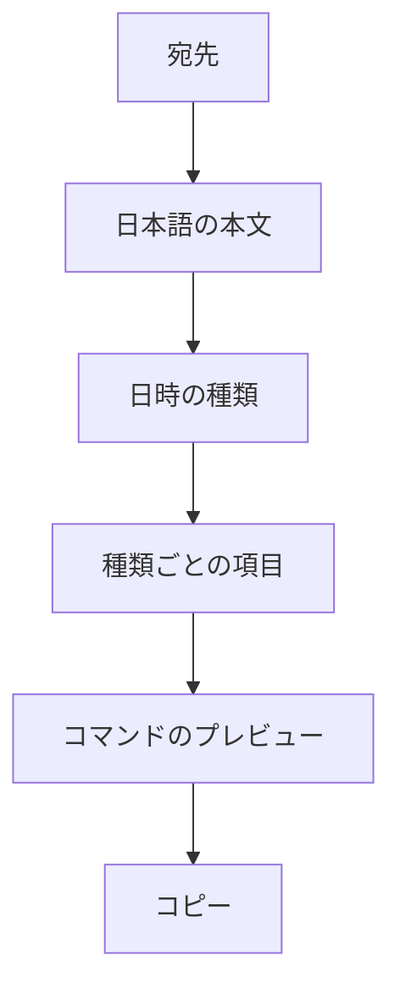

# Slack Remind Command Generator - Plan

## Goal Capsule

- **Objective:** 1画面のフォームを埋めて、英語構文の Slack `/remind`（本文は日本語可）をコピーできる。
- **Product authority:** この計画は個人向けブラウザ完結の生成器 v1 を対象にする。あとからの GitHub Pages 公開は配布手段であり、別製品ではない。
- **Open blockers:** 計画を止める項目はない。繰り返しの範囲は Slack が実際に受け付ける形に限る（Assumptions と Outstanding Questions を参照）。

## Product Contract

### Summary

構造化フィールド（宛先、日本語の本文、日時の種類）から `/remind` を組み立て、コピーする静的ページを作る。Slack API、アカウント、履歴保存はなし。

### Problem Frame

Slack の `/remind` は、繰り返しや宛先の書き方を間違えやすい。いまは手書きで作っており、まずローカルで動く生成器が欲しい。あとから静的サイトとして公開できればよい。

### Key Decisions

- **自然文解析ではなくフォームで組み立てる。** `(session-settled: user-directed — chosen over NL-from-one-sentence and hybrid when-parser: reliable Slack phrasing and a later GitHub Pages static site)` Governs R1, R6.
- **まずローカル。静的ホスティングは後から。** `(session-settled: user-directed — chosen over team-shared backend or public-from-day-one: start on the author's machine)` Governs R10.
- **v1 はコピーまで。** `(session-settled: user-directed — chosen over templates or generation history: smallest useful loop)` Governs R5.
- **コマンド本体は英語、本文は日本語。** `(session-settled: user-directed — chosen over all-Japanese or bilingual toggle: workspace prefers English `/remind` keywords)` Governs R3.
- **1列レイアウト。プレビューは下。** `(session-settled: user-directed — chosen over two-column preview and stepped wizard: all fields visible at once)` Governs R1, R4.
- **日時は種類を選んでから項目を出す。** `(session-settled: user-directed — chosen over calendar-first or preset buttons: wide recurrence stays tractable)` Governs R6, R7.

### Actors

- A1. 生成したコマンドを Slack に貼る人（このページの操作者でもある）。

### Requirements

**コマンド組み立て**

- R1. 画面は1つ。宛先、本文、日時の種類、その種類に必要な項目、ライブプレビュー、コピーの順。
- R2. 宛先は操作者（`me`）、チャンネル名、ユーザー名のいずれか。チャンネル名とユーザー名の欄は、そのモードのときだけ出す。
- R3. 生成コマンドのキーワードと日時は英語。リマインド本文は日本語でよい。
- R4. プレビューは項目の変更に合わせて更新する。「生成」ボタンは別途設けない。
- R5. コピー操作でコマンド全体をクリップボードに入れる。クリップボードが使えないときは、プレビューを選択して手動コピーできるようにする。

**日時の範囲**

- R6. 日時の種類を先に選ぶ。v1 の種類: 一度きり、毎日、平日、毎週（曜日指定）、隔週、毎月。
- R7. 種類ごとに必要な項目だけ出す（一度きりなら日付と時刻、毎週なら曜日と時刻など）。
- R8. 出す日時フレーズは Slack `/remind` が文書化して受け付けるものに限る。Slack が対応しない繰り返しは出さない。

**本文の安全**

- R9. 空白などで Slack の解釈が壊れそうな本文は、コマンドが1行の有効な `/remind` になるよう囲む。

**実行環境**

- R10. アプリはブラウザだけで動く。サーバー、Slack API、ログインはなし。同じ成果物をあとから GitHub Pages に載せられること。

### Key Flows

- F1. リマインドを組み立ててコピーする
  - **Trigger:** A1 がページを開く。
  - **Actors:** A1
  - **Steps:** 宛先を選ぶ（必要なら名前）。日本語の本文を入れる。日時の種類を選び、出た項目を埋める。プレビューを確認する。コピーする。Slack に貼る。
  - **Covered by:** R1, R2, R3, R4, R5, R6, R7
- F2. 未入力がある
  - **Trigger:** いまの種類で必須の項目が空。
  - **Actors:** A1
  - **Steps:** プレビューはまだコピーできないと分かる。コピーは無効、または理由を示して何もしない。項目を埋めるとコピーできる。
  - **Covered by:** R4, R5

### Acceptance Examples

- AE1. 毎週金曜の自分宛て
  - **Covers R2, R3, R6, R7.**
  - **Given:** 宛先は自分、本文は `週報を書く`、種類は毎週、曜日は金曜、時刻は 17:00。
  - **When:** 項目が揃っている。
  - **Then:** プレビューは英語の `/remind me to … every Friday at 5pm`（または Slack が受け付ける同等の形）で、日本語本文を含み、コピーはその文字列そのもの。
- AE2. チャンネルへの一度きり
  - **Covers R2, R7.**
  - **Given:** 宛先はチャンネル `general`、一度きりの日付と時刻が入っている。
  - **When:** プレビューを見る。
  - **Then:** コマンドの宛先は `#general`（または Slack が受け付けるチャンネル形）であり、`me` ではない。
- AE3. 日時項目が不足
  - **Covers F2, R5.**
  - **Given:** 種類は毎月で、月内の日が空。
  - **When:** A1 がコピーしようとする。
  - **Then:** 不正なコマンドはコピーされない。足りない項目が分かる。
- AE4. 空白を含む本文
  - **Covers R9.**
  - **Given:** 本文は `週報を書いて共有する`。
  - **When:** コマンドを生成する。
  - **Then:** Slack は空白で分割せず、本文を1つの引数として解釈できる。

### Scope Boundaries

**v1 に含む**

- 構造化フォーム、ライブプレビュー、クリップボードへコピー。
- 宛先: 自分、チャンネル、ユーザー。
- R6 の日時種類。ただし R8 の制限あり。

**後回し**

- 保存テンプレと生成履歴。
- 自然文入力。
- GitHub Pages への公開作業そのもの（アプリは静的ホスト可能であること。公開手順は後の運用）。
- チーム共有、認証、Slack API でのリマインダー作成。

**この製品ではない**

- コマンドを貼らずにリマインダーを登録する Slack アプリ。

### Dependencies / Assumptions

- Slack は操作者のワークスペースのタイムゾーンを使う。生成器は壁時計の文言だけ出し、タイムゾーン ID は付けない。
- 操作者のワークスペースは英語の `/remind`（`me`、`to`、`every weekday` など）を受け付ける。
- 「Slack が許す範囲の繰り返し」は、文書化された `/remind` の when 言語であり、任意の日付ライブラリではない。

### Outstanding Questions

- Deferred to Planning: R6 の各種類について、現行 Slack ヘルプで確認した正確な英語フレーズ（毎月・隔週を含む）。
- Deferred to Planning: 日本語と英語が混ざる行を Slack がどう解釈するか確認したうえでの、R9 の引用・エスケープ規則。
- Deferred to Planning: GitHub Pages 公開時に、リポジトリを Public にするかどうか（いまは Private）。
